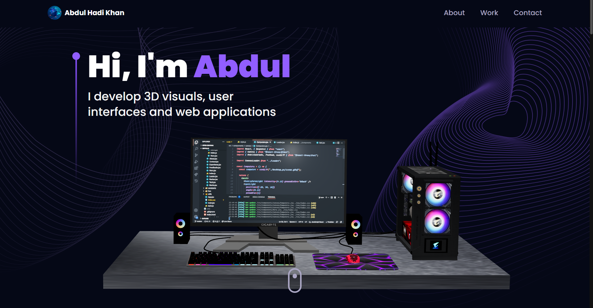

# Abdul Hadi Khan's Basic Portfolio Website

## Overview

This repository contains the code for my personal 3D portfolio website. The website showcases my projects, skills, and experiences.

## Sections

- **Overview**: A section that introduces me and my background.
- **Experience**: A timeline of my work experience and education.
- **Skills**: A rundown of my technical skills.
- **Projects**: A showcase of my projects with links to the GitHub repositories.
- **Testimonials**: A section with testimonials from professionals I have worked with.
- **Contact**: A section with my contact information and social media links.

## Usage

To run the website locally, follow these steps:

1. Clone the repository
2. Install the dependencies with `npm install`
3. Start the development server with `npm run dev`

 
